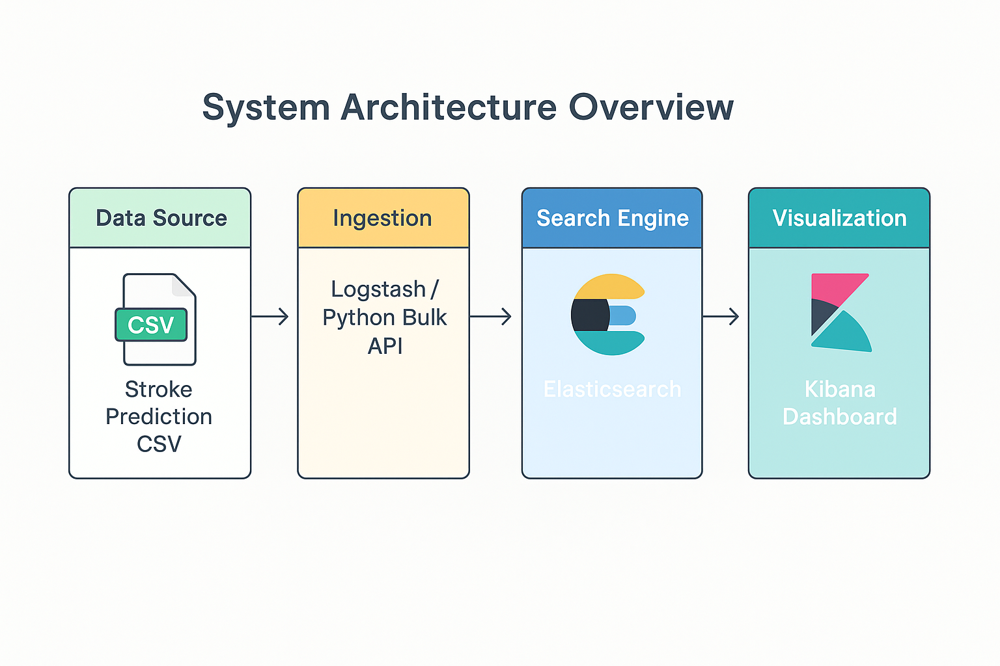

# 🛠️ Elasticsearch & Kibana Setup Guide (Windows)

This guide walks you through the full installation and setup process for Elasticsearch and Kibana.

---

## 📦 Step 1: Install Java (if not bundled)

Elasticsearch requires Java. Elasticsearch 8.x comes with a bundled JDK, so you **don’t need to install it manually** unless you're using an older version.

---

## 📥 Step 2: Download and Extract

- 🔗 Download Elasticsearch: [https://www.elastic.co/downloads/elasticsearch](https://www.elastic.co/downloads/elasticsearch)
- 🔗 Download Kibana: [https://www.elastic.co/downloads/kibana](https://www.elastic.co/downloads/kibana)

Extract both zip files to your preferred location.

---

## ⚙️ Step 3: Start Elasticsearch

Open Command Prompt in the **Elasticsearch directory** and run:

```bash
bin\elasticsearch.bat
```

Wait until the server is fully up. Look for:
```
[INFO ][o.e.n.Node               ] [your-node-name] started
```

---

## 🔐 Step 4: Set or Reset Password for Elastic User

In another Command Prompt window, run:

```bash
bin\elasticsearch-reset-password -u elastic
```

Copy the generated password — you’ll need it for logging into Kibana.

---

## 🔑 Step 5: Generate Enrollment Token (Optional for secure setup)

If Kibana requires a token, generate one:

```bash
bin\elasticsearch-create-enrollment-token -s kibana
```

Copy the token to use in the Kibana browser setup.

---

## 🚀 Step 6: Start Kibana

Open a **new Command Prompt** in the Kibana directory:

```bash
bin\kibana.bat
```

Wait until you see:

```
Kibana is running at http://localhost:5601
```

---

## 🌐 Step 7: Open Kibana in Browser

Go to:

```
http://localhost:5601
```

- If prompted, paste the **enrollment token** from Step 5.
- Login using:
  - **Username:** `elastic`
  - **Password:** (from Step 4)

> ⚠️ Ignore certificate warnings by clicking **Advanced → Proceed to localhost**.

---

## ✅ Done!

We are now ready to use Kibana for creating dashboards, visualizations, and exploring our Elasticsearch data. 🎉

---
---
---

## 📊 Project Task Instructions

This section describes how each part of the health monitoring system using Elasticsearch and Kibana was built and implemented.

---

## 🧩 Task 1: Data Ingestion into Elasticsearch

This step covers how to prepare the dataset, define correct mappings, and index the data into Elasticsearch.

### 🔄 Step 1: Preprocess the Dataset

- Open your Python IDE or Jupyter Notebook.
- Install required libraries using pip: install `pandas`, `json`, and `elasticsearch`.
- Load the Stroke Prediction dataset (CSV format).
- Replace all occurrences of `'N/A'` with `None` to handle missing values properly.
- Convert the `bmi` column to float and fill any missing values using the column's median.
- Change the datatype of `hypertension`, `heart_disease`, and `stroke` columns to boolean.
- For better consistency, convert all categorical columns like `gender`, `ever_married`, `work_type`, `Residence_type`, and `smoking_status` to lowercase.

### 🧾 Step 2: Prepare Data for Bulk Indexing

- Remove the `id` column from the main data and use it as a unique `_id` for indexing each document.
- Create a JSON-formatted file (in NDJSON format) where each document is preceded by its index instruction.
- Save this file to your working directory for ingestion into Elasticsearch.

### 🏗️ Step 3: Define Elasticsearch Mapping

- Connect to your running Elasticsearch instance using the official Python client.
- If an index named `stroke_data` already exists, delete it to avoid conflicts.
- Create a new index named `stroke_data` with appropriate mappings:
  - Use `keyword` type for categorical fields like `gender`, `ever_married`, `work_type`, etc.
  - Use `float` for numerical fields like `age`, `avg_glucose_level`, and `bmi`.
  - Use `boolean` for `hypertension`, `heart_disease`, and `stroke`.

### 🚚 Step 4: Index the Data

- Open the NDJSON file created in Step 2.
- Read each pair of index instruction and document, and store them in a list of actions.
- Use the `bulk()` helper from the Python Elasticsearch client to insert all documents in one go.
- Verify that documents were successfully indexed.
---


---

## 📊 Task 2: Kibana Dashboard Design

This step involves designing interactive and insightful visualizations in Kibana based on the dataset fields.

### 🎨 Step 1: Open Kibana and Access Visualizations

- Launch Kibana by navigating to `http://localhost:5601` in your browser.
- In the left menu, click on **"Visualize Library"** or go to **"Dashboard"** > **"Create new visualization"**.
- Select **"Index pattern"** (e.g., `stroke_data`) as the data source.
- Choose the appropriate visualization type for each field.

### 🟠 Step 2: Create Individual Visualizations

Create the following charts using their respective data fields:

#### ✅ Pie / Donut Charts

- Use **Pie** or **Donut** charts for:
  - `gender`
  - `ever_married`

Steps:
- Choose Pie chart.
- Use the field (e.g., `gender`) in the **"Split slices"** bucket.
- Use **"Count"** as the metric.

#### 📊 Bar / Stacked Bar Charts

- Use **Bar** or **Stacked Bar** charts for:
  - `hypertension`
  - `heart_disease`
  - `smoking_status`

Steps:
- Choose Vertical Bar chart.
- Select the categorical field under **X-Axis**.
- Use **"Count"** for the Y-Axis metric.
- Enable "stacked" style if needed for comparisons.

#### 📈 Histogram / Line Charts

- Use **Histogram** or **Line** charts for:
  - `age`
  - `avg_glucose_level`

Steps:
- Choose Line or Histogram chart.
- Set the field (e.g., `age`) as X-Axis.
- Use **"Count"** or **"Average"** as the Y-Axis metric.

#### 🌡️ Heatmap and Alerts for Stroke Risk

- Create a **Heatmap** using `age` and `avg_glucose_level` as X and Y axes.
- Use the `stroke` field as a filter or coloring dimension.
- Set up **alert triggers** (under "Stack Management" > "Rules") to notify if count of high-risk cases (where `stroke` is true) exceeds a certain threshold.

### 🧩 Step 3: Add to Dashboard

- After saving each visualization, go to **Dashboard**.
- Click **"Create Dashboard"** and give it a title.
- Click **"Add"** to include your saved charts.
- Arrange them neatly for better readability and comprehension.

---

---

## 🧠 Task 3: Interactive Filtering & Drilldown

This step enhances the dashboard with interactive filtering and drilldowns to allow users to explore specific subgroups and patterns in the dataset.

### 🧩 Step 1: Add Filters to the Dashboard

- Open your **Kibana Dashboard** where the visualizations are added.
- On the top bar, click **"Add filter"**.
- Create filters for the following fields:
  - `gender`
  - `age`
  - `work_type`
  - `stroke`

Instructions:
- For each field, select it from the list.
- Choose the condition type (e.g., "is", "is between", etc.).
- Input or select the values you want to filter by.
- Click **"Save"** to apply the filter.

> 🧠 Tip: You can use **range filter** for `age` to explore specific age brackets like "under 30", "30–50", or "above 50".

### 🔍 Step 2: Enable Dynamic Drilldowns

Drilldowns allow users to click on chart elements and navigate deeper into filtered views.

Steps to add a drilldown:
1. Go to **Visualize Library** and select the chart you want to add a drilldown to.
2. Click on the three-dot menu **(⋮)** next to the visualization and choose **"Create drilldown"**.
3. Choose **Dashboard navigation** as the drilldown type.
4. Set the destination as your current dashboard or another relevant dashboard.
5. Define filters to pass (e.g., when clicking on `stroke: true`, it filters the dashboard accordingly).
6. Save the visualization with the drilldown enabled.

> 🔄 Example: Clicking on a bar in the `smoking_status` chart can take the user to a filtered dashboard view showing stroke cases within that smoking category.
---

---

## 🏗️ Task 5: System Architecture Overview

This task involves understanding and visualizing the overall system architecture for the health monitoring dashboard that integrates Elasticsearch and Kibana. Below is a detailed description of the system architecture, which includes the components and data flow.

### 🧩 Architecture Components:

1. **Stroke Prediction Dataset**:
   - The **Stroke Prediction Dataset** serves as the data source. It contains patient health parameters such as gender, age, glucose level, BMI, and others that will be used to predict stroke risk.
   
2. **Data Ingestion**:
   - The data is ingested into Elasticsearch using either **Logstash** or the **Python Bulk API**. This is responsible for converting the dataset into a format compatible with Elasticsearch (e.g., JSON or CSV).
   
3. **Elasticsearch**:
   - **Elasticsearch** is the search engine that indexes the stroke prediction data, providing fast search capabilities and support for complex queries and aggregations.
   
4. **Kibana**:
   - **Kibana** is the visualization tool that connects to Elasticsearch and creates dynamic dashboards. It visualizes data through different charts (e.g., pie charts, bar graphs, heatmaps), allowing healthcare providers to track health parameters in real time and identify high-risk individuals.

### 🖼️ Architecture Diagram

Here is the architecture flow, showing how data moves from the Stroke Prediction Dataset through Logstash/Python Bulk API into Elasticsearch, and how Kibana fetches data from Elasticsearch for visualization.




### 🚀 Summary:

- **Data Source**: The **Stroke Prediction Dataset**.
- **Ingestion**: Using **Logstash** or **Python Bulk API** to load data into **Elasticsearch**.
- **Search Engine**: **Elasticsearch** stores and indexes the data.
- **Visualization**: **Kibana** connects to Elasticsearch to create interactive dashboards and visualizations.

This system enables real-time health monitoring by continuously ingesting new data, visualizing health parameters, and providing insights for healthcare providers.

---

